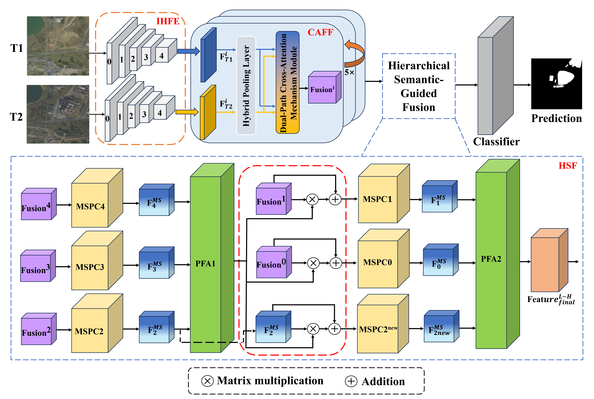
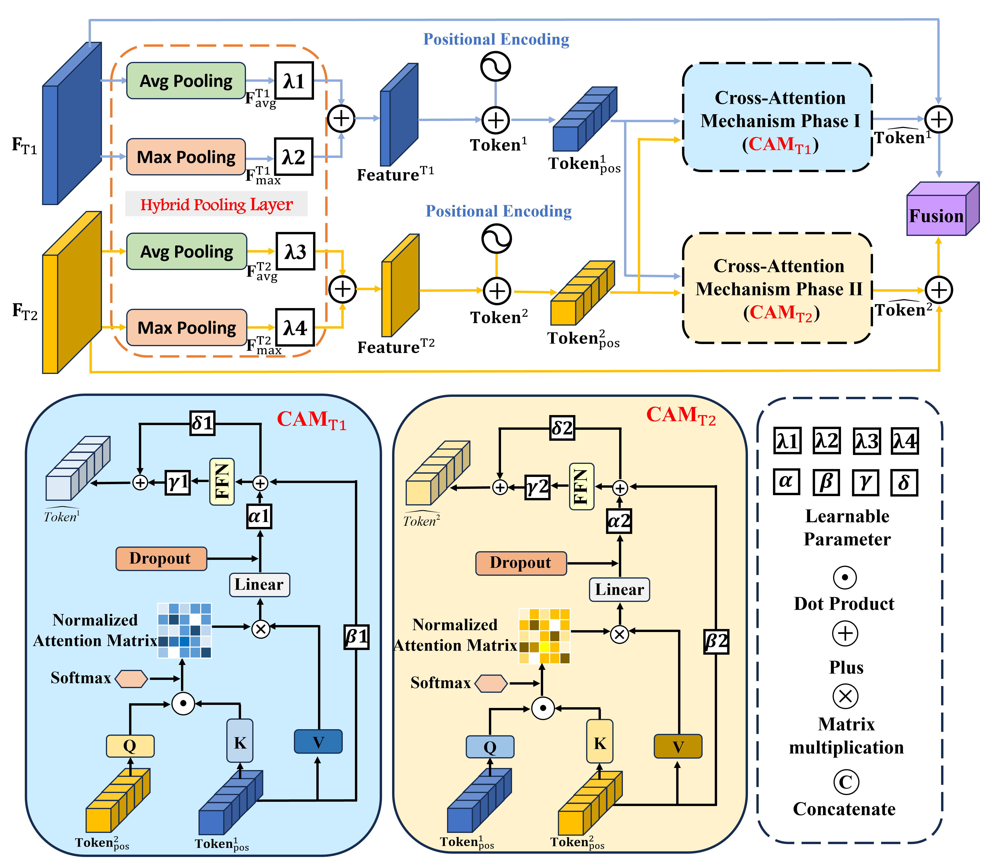

# A Semantic-Guided Cross-Attention Network for Change De-tection in High-Resolution Remote Sensing Images

## Program description
This repository contains all the code needed to reproduce the paper:
A Semantic-Guided Cross-Attention Network for Change De-tection in High-Resolution Remote Sensing Images






This program implements automated cropping, recognition, splicing and conversion into shp files. 
If you have any questions please contact: yaoshunyu9401@gmail.com

## Requirements
```
Python 3.10
pytorch 1.13.0
torchvision 0.14.0
einops  0.6.1
gdal  3.4.3
tifffile 
```

## Data description
IWHR_data: Our split in https://pan.baidu.com/s/1S4iuJf4yktZA3I99beiuRg pwd:2024

LEVIR-CD:https://chenhao.in/LEVIR/

Note: Please crop the LEVIR dataset to a slice of 256×256 before training with it.

### data preparation

```
"""
The folders of the two periods of remote sensing images are in the dateset folder.；
├─T1
├─T2
├─label
└─crop_256
"""
```
`T1`: t1 phase;

`T2`: t2 phase;

`label`: label maps, if prediction is performed, image files with the same name as T1 and T2 will be placed in this folder.
, the row and column size is consistent with the image files with the same name as T1 and T2, this image does not participate in prediction;

`crop_256`: contains `A, B, label, List and predict`, 
This folder and its contents can be automatically generated, and the shp file of the final prediction result will also be placed under this folder.

### Dataset structure

```
"""
Change detection data set with pixel-level binary labels；
├─A
├─B
├─label
└─list
"""
```


## Instructions for running the script

### Predict
Find the training script `run_cd.sh` in the `scripts` folder. This script integrates automatic cropping.
Obtain the cropped picture list, read the data and perform forward propagation prediction, assign coordinate splicing to the predicted image spots, and
Convert to shp file, filter out smaller patches, and realize automatic patch extraction and processing of remote sensing images

You can run `sh scripts/run_cd.sh` in the terminal (note: check the python environment and path, path
It must be consistent with the python project).

 The details in `run_server.sh` are as follows

```cmd
#!/usr/bin/env bash
gpus=0
checkpoint_root=checkpoints
data_name=LEVIR

img_size=256
batch_size=8
lr=0.01
max_epochs=200
net_G=SCANet
lr_policy=linear

split=train
split_val=val
project_name=CD_${net_G}_${data_name}_b${batch_size}_lr${lr}_${split}_${split_val}_${max_epochs}_${lr_policy}

python main_cd.py --img_size ${img_size} --checkpoint_root ${checkpoint_root} --lr_policy ${lr_policy} --split ${split} --split_val ${split_val} --net_G ${net_G} --gpu_ids ${gpus} --max_epochs ${max_epochs} --project_name ${project_name} --batch_size ${batch_size} --data_name ${data_name}  --lr ${lr}

```
